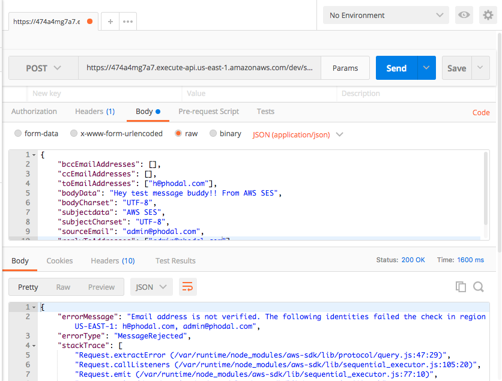

Serverless 应用开发指南：使用 SES 创建邮件发送接口
===

当你有一个不成熟的 Idea 时，作为一个受精益思想影响的开发者，那么你可能会学习 Dropbox 创建一个 Landing Page 来验证你的想法。如下图所示：


这个时候，你只需要大胆地公布出你的 Idea。等待用户的到来、在网页上提交他们的邮箱 blabla。然后在产品准备得差不多的时候，就可以大声地告诉全世界，你们可以来试用了。不过，这只里我们只讨论如何来发送邮件。

对于诸如邮件发送、短信发送等服务的业务场景来说，采用 Serverless 特别合适——当然，如果你也使用 AWS 服务就更好了。我们只需要将相关的参数，发送到对应的接口即可。

这次我们要用到的 AWS 服务是 SES（Simple Email Service）。

> Amazon Simple Email Service (Amazon SES) 为基于云端的电子邮件发送服务，旨在帮助数字营销师和应用程序开发师发送营销、通知和业务电子邮件。对于使用电子邮件联系客户的所有规模的企业来说，它是一种可靠且经济实用的服务。

说了这么多，还不如动手操作一下。

Serverless Email 发送
---

笔者创建的服务最初是基于：[AWS-SES-Serverless-Example](https://github.com/lakshmantgld/aws-ses-serverless-example.git)。

好了，下面让我们安装这个 Serverless 服务：

```
serverless install -u https://github.com/phodal/serverless-guide/tree/master/ses -n ses
```

然后执行：

```
yarn install
```

接着复制一份 ``config.copy.json`` 为 ``config.json``，然后在其中配置上相关的内容：

```
{
  "aws": {
    "accessKeyId": "",
    "secretAccessKey": "",
    "region": ""
  }
}
```

就可以愉快地部署了：

```
$ serverless deploy

...
Serverless: Stack update finished...
Serverless: Invoke aws:info
Service Information
service: aws-ses
stage: dev
region: us-east-1
stack: aws-ses-dev
api keys:
  None
endpoints:
  POST - https://474a4mg7a7.execute-api.us-east-1.amazonaws.com/dev/sendMail
functions:
  sendMail: aws-ses-dev-sendMail

Stack Outputs
SendMailLambdaFunctionQualifiedArn: arn:aws:lambda:us-east-1:706605665335:function:aws-ses-dev-sendMail:1
ServiceEndpoint: https://474a4mg7a7.execute-api.us-east-1.amazonaws.com/dev
ServerlessDeploymentBucketName: aws-ses-dev-serverlessdeploymentbucket-14jvptxerdtxi

Serverless: Invoke aws:deploy:finalize
```

这次的代码也很简单，主要是通过 aws-sdk 中的 SES 来发送邮件：

```
import AWS from 'aws-sdk';
let ses = new AWS.SES();

module.exports.sendMail = (event, context, callback) => {
  ...
  ses.sendEmail(emailParams, function (err, data) {
      if (err) {
          console.log(err, err.stack);
          callback(err);
      } else {
        console.log("SES successful");
        console.log(data);

        callback(null, response);
      }
  });
}
```

代码中便是直接调用相关的参数的。

接下来就是测试时间了。

Serverless Email 发送测试
---

我按照项目的参数配置：

```
{
    "bccEmailAddresses": [],
    "ccEmailAddresses": [],
    "toEmailAddresses": ["xxx@qq.com"],
    "bodyData": "Hey test message buddy!! From AWS SES",
    "bodyCharset": "UTF-8",
    "subjectdata": "AWS SES",
    "subjectCharset": "UTF-8",
    "sourceEmail": "xxx@qq.com",
    "replyToAddresses": ["xxx@qq.com"]
}
```

在 PostMan 上进行了测试：



然后报错了：

```
{
    "errorMessage": "There were 3 validation errors:\n* MissingRequiredParameter: Missing required key 'Source' in params\n* MissingRequiredParameter: Missing required key 'Data' in params.Message.Body.Text\n* MissingRequiredParameter: Missing required key 'Data' in params.Message.Subject",
    "errorType": "MultipleValidationErrors",
    "stackTrace": [
        "* MissingRequiredParameter: Missing required key 'Source' in params",
        "* MissingRequiredParameter: Missing required key 'Data' in params.Message.Body.Text",
        "* MissingRequiredParameter: Missing required key 'Data' in params.Message.Subject",
        "ParamValidator.validate (/var/runtime/node_modules/aws-sdk/lib/param_validator.js:40:28)",
        "Request.VALIDATE_PARAMETERS (/var/runtime/node_modules/aws-sdk/lib/event_listeners.js:125:42)",
        "Request.callListeners (/var/runtime/node_modules/aws-sdk/lib/sequential_executor.js:105:20)",
        "callNextListener (/var/runtime/node_modules/aws-sdk/lib/sequential_executor.js:95:12)",
        "/var/runtime/node_modules/aws-sdk/lib/event_listeners.js:85:9",
        "finish (/var/runtime/node_modules/aws-sdk/lib/config.js:315:7)",
        "/var/runtime/node_modules/aws-sdk/lib/config.js:333:9",
        "Credentials.get (/var/runtime/node_modules/aws-sdk/lib/credentials.js:126:7)",
        "getAsyncCredentials (/var/runtime/node_modules/aws-sdk/lib/config.js:327:24)",
        "Config.getCredentials (/var/runtime/node_modules/aws-sdk/lib/config.js:347:9)"
    ]
}
```

后来，才发现 SES 上有一行解释。

> 对于 Amazon SES 新用户 – 如果您尚未申请提高发送限制，则仍将处于沙箱环境中，且只能发送电子邮件至您之前验证过的地址。要验证新电子邮件地址或域，请参阅 Amazon SES 控制台的身份管理部分。

于是便登录 SNS，新增了一个验证邮箱。


试了 gmszone@qq.com 、网易邮箱都不行，最后用了 Google 的。

最后，终于可以接收到邮件了。

